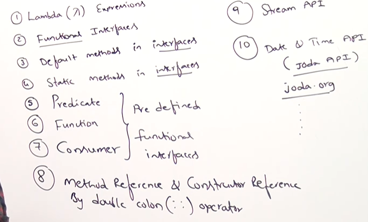

### Why Java 8?
1. Java 8 came to reduce boilerplate code and make java code shorter and more readable using lambda expression.
2. It become more readable using lambda expression.<br>
**Before Java 8**
```Java
    Collections.sort(list, new Comparator<Integer>() {
    @Override
    public int compare(Integer a, Integer b) {
        return a - b;
    }
});
```
**After Java 8**
```Java 
  Collections.sort(list, (a, b) -> a - b);
```
3. It introduce stream api to process collections more easily.<br>
**Before Java 8**
```Java
List<Integer> result = new ArrayList<>();

for(int n : list) {
    if(n % 2 == 0) {
        result.add(n);
    }
}
```
**After Java 8**
```Java
list.stream()
    .filter(n -> n % 2 == 0)
    .forEach(System.out::println);
```
4. It support parallel processing.<br>
**Before Java 8**
```Java
parallelStream()
```
**After Java 8**
```Java
list.parallelStream().forEach(System.out::println);
```
5. It modernized java with feature like functional programming, better Date/Time API and default methods in interface

#### Topics need to be cover


## Default Methods
##### Why we need default methods
Before Java 8 an interface contain one abstract method m1 and sub class A nd sub class B who are implementing that interface need to provide implementation of that method. After sometime class A need another method m2 so we declared the abstract method in interface so class B forcefully need to provide the implementation of m2 here the default method came into the picture.  

###### Default Method :- 
It is an interface method that has implementation body.<br>
It is optional to provide implementation in sub classes.<br>
**Synatax:-**
```Java
    Interface example{
        abstract void m1();
        default void m2(){
            //Body of amethod m2
        }
    }
```
## Static Methods
Static method in an interface belongs to the interface itself not to implementation class.
```Java
    interface test {
        static int sum (int a, int b){
            return a + b;
        }
    }
    class Main {
        public static void main(String[] args){
            int res = test.sum(10,20);
            System.out.println(res); // O/P 30
        }
    }
```
-To keep utility/helper methods related to the interface inside the interface itself we use Static Methods.
##### Difference between default method and static method
| Feature                         | Default Method | Static Method |
| ------------------------------- | -------------- | ------------- |
| Inherited by implementing class | ✅ Yes          | ❌ No          |
| Can be overridden               | ✅ Yes          | ❌ No          |
| Called using object             | ✅ Yes          | ❌ No          |
| Called using interface name     | ❌ Usually not  | ✅ Yes         |

###### Functional Programing
By using functional programing we can pass function as an argument to a method.

### Functional Interface
An interface which has only one abstract method is called functional interface.<br>
**Example:-** <br>
```Java
    interface abc{
        public abstract void add(int a, int b);
    }
```
- It is also known as SAM interface **Single Abstract Method**. <br>
- If an interface has only one abstarct method compiler consider it as a functional interface. Then compiler allow us to create  lambda expression  from this interface. <br>
- If an interface has more than one abstract method then compiler will not consider it as a functional interface. Then compiler will not allow us to create lambda expression.

### Methods allowed using @FunctionalInterface Annotation
a) public void add(int a, int b); only one abstract method is allowed.<br>
b) public static final int a = 10; Multiple static final methods are allowed<br>
c) public static class A {} Multiple inner classes are allowed <br>
d) public default void m1(){} Multiple default methods are allowed <br>
e) public static void m3(){} multiple static methods are allowed <br>
f) private static void m1(){} private static methods are not allowed till version 8 in version 9 it is allowed<br>
g) public abstract int hashCode(){} Java.lang.object class methods are allowed as abstract method in functional interface<br>
h) public default String toString(){
    return "HK";   // Java.lang.object class method are not allowed as a default method are not allowed as default method in functional interface
}<br>

**Important Points**
- If a functional interface deriving from another functional interface and it is creating another abstract method then it is not allowed
```Java
    @FunctionalInterface
    interface A {
        void m1() {} //abstract method
    }
    @FunctionalInterface
    interface B extends A{
        void m2() {} // It will give compile time error  because if you mark it as a functional interface the it contain only one functional interface
    } 
```
- If a non-functional interface extending functional interface then multiple abstract methods are allowed
```Java
    @FunctionalInterface
    interface A{
        void m1(){}
    }
    interface B extends A{
        void m2(){} // No compile time error because this interface is not a functional interface.
    }
```
#### Types of functional interface
**1. Consumer**<br>
Represents an operation, that accept a single input parameter and returns no result.<br>
    - present in **java.util.function**<br>
```Java
    @FunctionalInterface
    public interface Consumer<T> {
        void accept(T t);
    }
    public class Main{
        Consumer<Integer> loggingObject = (Integer val) -> {
            if(val > 10){
                System.out.println("Logging");
            }
        }
        loggingObject.accept(11);
    }
```
**2. Supplier** <br>
Represent the supplier of the result, accepts no input parameter but produce a result.<br>
    - Present in **java.util.function**<br>
```Java
    @FunctionalInterface
    public interface Supplier<T>{
        T get();
    }
    public class Main{
        public static void main(String[] args){
            Supplier<String> isEvenNumber = () -> "This data is an even number data";
            System.out.println(isEvenNumber.get());
        }    
    }
```
**3. Function**<br>
Represent function, that accept one argument process it and produce a result.<br>
    - Present in package **java.util.function**<br>
```Java
        @FunctionalInterface
        public interface Function<T,R>{
            R apply(T t);
        }
        public class Main{
            public static void main(String[] args){
                Function<Integer, String> intToStr = (Integer num) -> {
                    String output = num.toString();
                    return output;
                }
                System.out.println(Function.apply(11);
            }
        }
```
**4. Predicate**<br>
Represents :- A condition that returns true or false<br>
- It takes one input
- Return boolean
**Functional Method of Predicate**
  ```Java
    boolean test(T t)
  //T = input type
  //Return type = boolean
  ```
It is heavily used in:<br>
- Stream API
- Filtering
- Validation
- Conditional checks
- Business rules
```Java
    Predicate<Integer> isEven =
    n -> n % 2 == 0;

    System.out.println(isEven.test(4));
    System.out.println(isEven.test(7));
```
**Example**
```Java
import java.util.function.*;
import java.util.ArrayList;

class Employee{
    String name;
    int salary;
    Employee(String name, int salary){
        this.name = name;
        this.salary = salary;
    }
}
class Main {
    public static void main(String[] args) {
        ArrayList<Employee> l = new ArrayList<Employee>();
        l.add(new Employee("Mannat",20000));
        l.add(new Employee("Rohan",50000));
        l.add(new Employee("Vikas",40000));
        l.add(new Employee("Deepanshi",200000));
        Predicate<Employee> ep = e -> e.salary > 30000;
        for(Employee e1 : l){
            if(ep.test(e1)){
                System.out.println(e1.name + " " + e1.salary);
            }
        }
    }
}
```
### Lambda Expression
An anonymous function used to implement functional interface.<br>
**Syntax:-**
```Java
    (a,b) -> a * b;
```
- Lambda expression can't work without functional interface it require functional interface.<br>
**Imp:-** A Lambda expression is an object which is an instance of one functional interface implementation class which is internally generated by compiler dynamically through a lambda expression.<br>
**1. Lambda Expression**<br>
A lambda expression is shorthand for writing an implementation of that single abstract method.
```Java
    Function<Integer, String> intToStr = (num) -> num.toString();
```
**2. Compiler’s Role**<br>
    - When you write a lambda, the compiler doesn’t just leave it as “inline code.”<br>
    - It generates a hidden class (an implementation of the functional interface) behind the scenes.<br>
    - That class overrides the abstract method (apply) with the body of your lambda.<br>
**3. Instance Creation**<br>
    - The lambda expression creates an object (an instance of that hidden class).<br>
    - So intToStr is actually a reference to an object of a compiler-generated class that implements Function<Integer, String>.<br>
**4. Dynamic Binding**<br>
    - This process is dynamic — the compiler and JVM handle it at runtime using invokedynamic instructions.<br>
    - That’s why lambdas are lightweight compared to anonymous inner classes.<br>
##### Lambda Expression in collection
```Java
    class Main{
        public static void main(String[] args){
            ArrayList<Integer> l = new ArrayList<>();
            l.add(20);
            l.add(5);
            l.add(10);
            l.add(15);
            Comparator<Integer> c = (I1,I2) -> (I1<I2)?-1:(I1>I2)?1:0;
            Collections.sort(l,c);
            System.out.println(l);
        }
    }
```
### Anonymous Class
A class without any name is known as anonymous inner class. An anonymous inner classs can extends as class or can implements an interface.
```Java
    Thread t = new Thread()
    {
        // anonymous inner class can extends a thread class.
    }

    Runnable r = new Runnable()
    {
        // anonymous inner class extends an interface.
    }
```
- Anonymous inner class is more powerful than lambda expression because if an interface having two methods we can't use lambda expression because that interface is not a functional interface any more.
- For functional interface we can use lambda expression in place of anonymous inner class.
